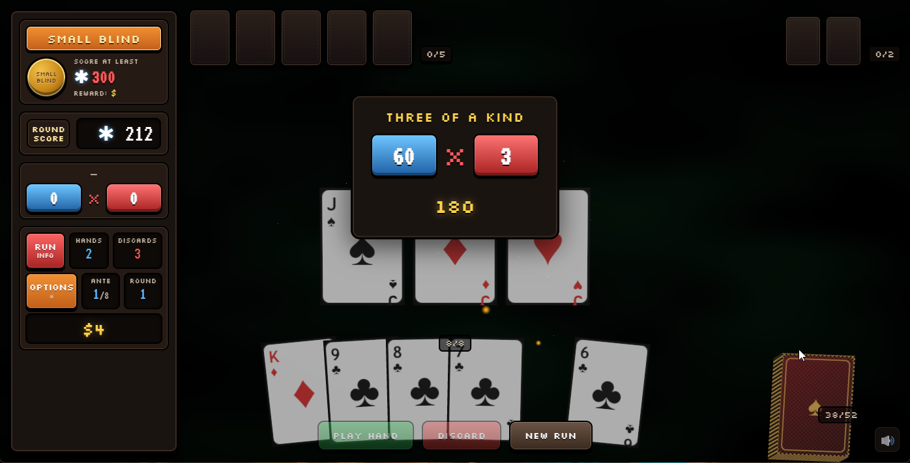

# Open Poker

> A browser-based poker roguelike prototype — built with TypeScript, Three.js, Vite, GSAP, and Howler.

Open Poker is an open-source, Balatro-inspired card game running entirely in the browser. It currently features a playable hand loop, poker scoring with chips × multiplier, animated 3D cards, procedural card textures, and drop-in art overrides.

The project aims to be **easy to run, easy to read, and easy to extend** — a friendly playground for contributors interested in card games, roguelikes, web rendering, or game feel.



---

## Features

- 🎴 **3D card table** rendered with Three.js, with smooth GSAP-driven animations.
- ♠️ **Poker hand evaluation** with Balatro-style chips × multiplier scoring.
- 🎲 **Seeded run state** with antes, blinds, hands, discards, deck, and score targets.
- 🖱️ **Interactive flow** — card selection, play, discard, scoring popups, win/lose states.
- 🎨 **Procedural card faces and backs**, with optional PNG/JPG/WEBP overrides from `public/art`.
- 🔊 **Synthesized audio** via Howler — no audio assets required to get started.
- 📦 **Zero backend** — pure static build, deploys anywhere.

---

## Getting Started

### Requirements

- [Node.js](https://nodejs.org/) 20 or newer
- npm (bundled with Node.js)

### Install and run

```bash
npm install
npm run dev
```

Vite will print a local URL, typically `http://localhost:5173`.

### Available scripts

| Command            | Description                                       |
| ------------------ | ------------------------------------------------- |
| `npm run dev`      | Start the Vite dev server with hot reload.        |
| `npm run build`    | Type-check and produce a production build.        |
| `npm run preview`  | Serve the production build locally.               |
| `npm run gen-art`  | Generate placeholder art into `public/art`.       |

---

## Project Structure

```text
src/
  main.ts          App entry point.
  style.css        Global styles.
  audio/           Audio manager and procedural sound synthesis.
  game/            Renderer-agnostic cards, game state, poker engine, and types.
  render/          Three.js scene, card objects, textures, particles, and input.
public/
  art/             Optional art overrides (cards, backs, blinds, jokers, UI).
  examples/        Screenshots and media used in docs.
scripts/
  generate-dummy-art.mjs   Placeholder art generator.
```

The split between `src/game` (rules, pure logic) and `src/render` (Three.js) is intentional — please keep it that way when contributing.

---

## Adding Art

Drop PNG, JPG, or WEBP files into `public/art/`. Art can be added one file at a time; anything missing falls back to procedural textures automatically.

See [public/art/README.md](public/art/README.md) for filenames, recommended resolutions, and override behavior.

You can also run `npm run gen-art` to quickly generate placeholder images for testing.

---

## Contributing

Contributions are very welcome! Some good first areas:

- Poker rule fixes and scoring edge cases.
- UI polish, accessibility, and responsive layout improvements.
- 3D interaction and animation tuning.
- Sound design.
- Card, blind, joker, and UI artwork.
- Tests for the game logic and poker engine.
- Documentation improvements.

Please read [CONTRIBUTING.md](CONTRIBUTING.md) before opening a pull request, and follow the [Code of Conduct](CODE_OF_CONDUCT.md).

### Development guidelines

- Keep game rules in `src/game` renderer-agnostic.
- Keep Three.js-specific behavior in `src/render`.
- Prefer small, focused pull requests that are easy to review.
- Run `npm run build` before submitting changes.

---

## Tech Stack

- **[TypeScript](https://www.typescriptlang.org/)** — typed game logic.
- **[Vite](https://vitejs.dev/)** — dev server and bundler.
- **[Three.js](https://threejs.org/)** — 3D rendering.
- **[GSAP](https://gsap.com/)** — animation.
- **[Howler.js](https://howlerjs.com/)** — audio.

---

## License

No license has been selected yet. Until one is added, please ask before reusing this code or assets outside this repository.
